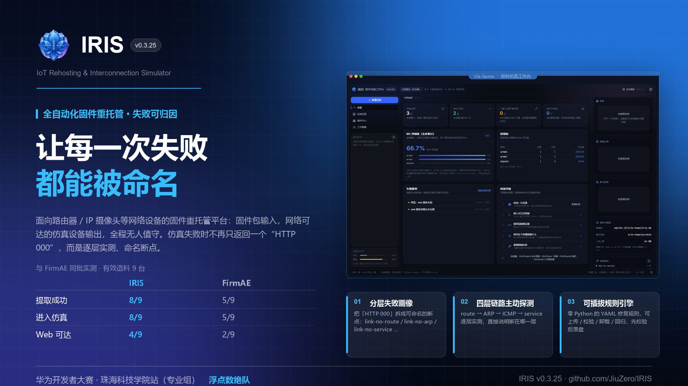
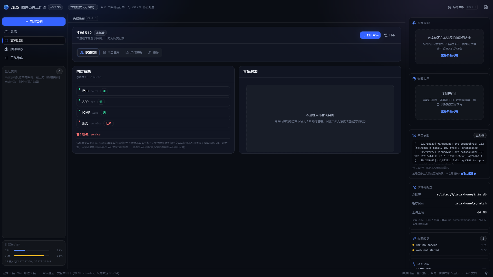
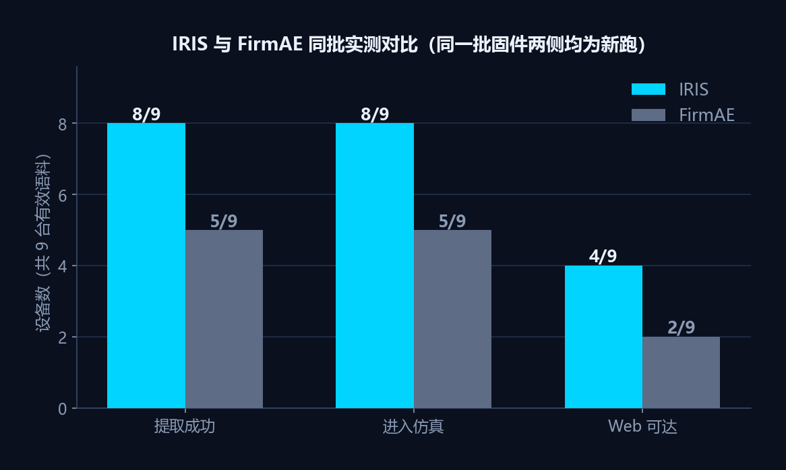
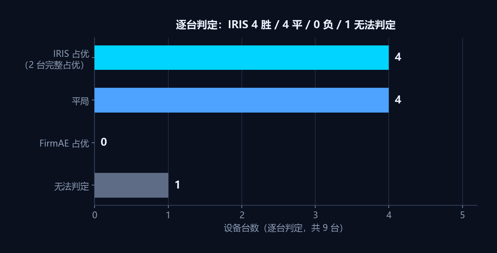
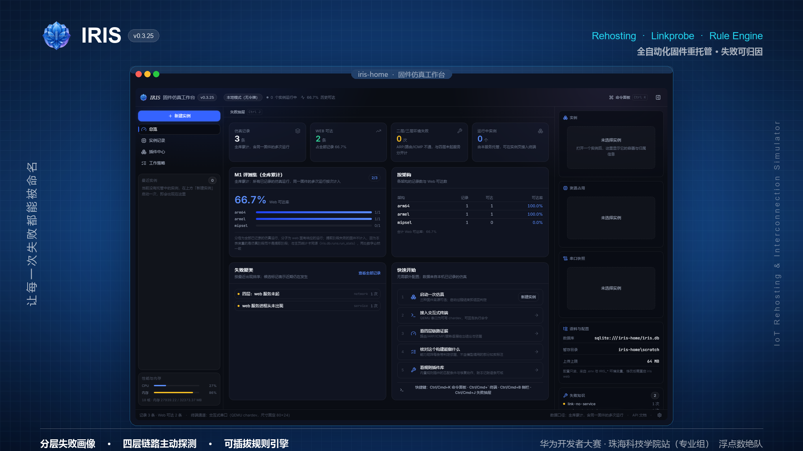
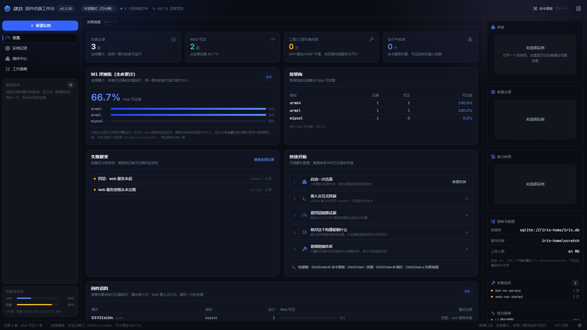
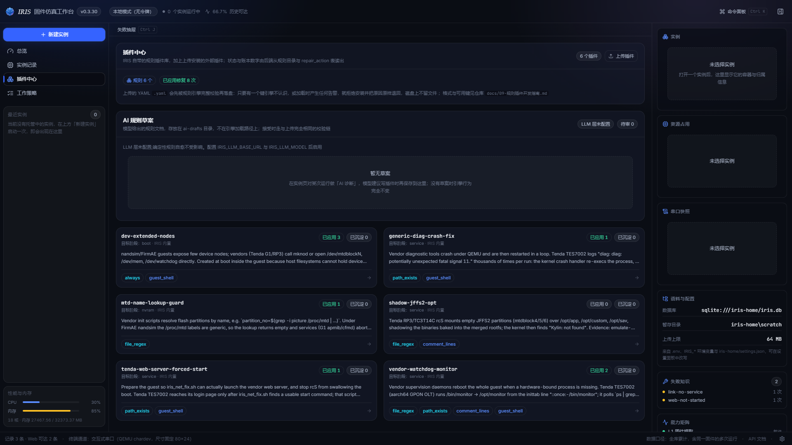
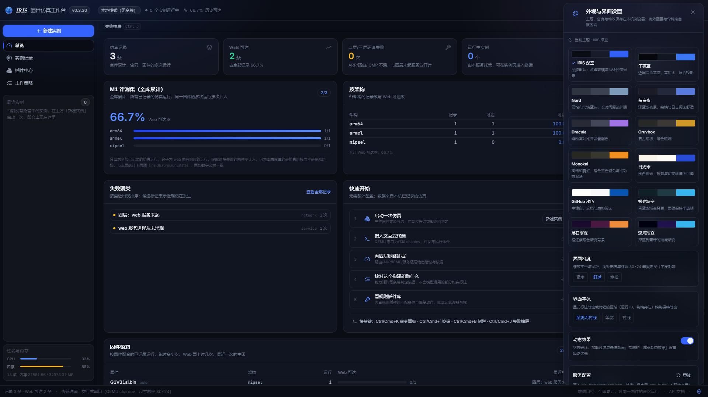
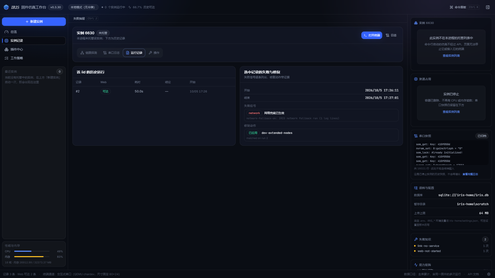

<p align="center">
  
</p>

# IRIS — IoT Rehosting & Interconnection Simulator（鸢尾）

<p align="center">
  <strong>面向路由器、IP 摄像头等网络设备的全自动化固件仿真（Rehosting）平台</strong><br/>
  固件包输入，网络可达的仿真设备输出；全程无人值守，<strong>失败可归因</strong>
</p>

<p align="center">
  
  
  
  
</p>

> 命名寓意：**I**oT **R**ehosting & **I**nterconnection **S**imulator；相机光圈（摄像头场景）、虹膜（看清设备内部）。

## ① 痛点：固件重托管为什么难

把一台真实路由器的固件包变成一台能在 QEMU 里访问的"虚拟设备"，学术界做了十年
（Avatar → firmadyne → FirmAE → FirmPilot）。这条路线的瓶颈从来不是"跑不起来"，
而是**跑不起来的时候说不清为什么**：

- 一个二进制固件包进去，工具吐回一个 `HTTP 000`。它是没解包？内核没起？网卡没配 IP？
  路由不通？服务没监听？端口转发没建立？——**同一个符号，六种完全不同的病因**。
- 于是研究者的时间大量花在"重新手工走一遍工具内部的每一步"，而不是花在设备本身上。
- 更糟的是失败会伪装成结论。本项目自己的 `docs/08-与FirmAE对比.md` 就记录了两次被推翻的
  DIR-868L 结论：第一次记成"服务起、VLAN 路由不通"，第二次记成"宿主与 guest 不同子网"，
  最终查明真实根因是宿主桥地址不在 guest 子网内被静默丢弃——**是宿主基础设施缺陷，
  既不是固件缺陷，也不是 VLAN 问题**。

**失败的不可解释，才是这条路线的真问题。**

## ② IRIS 的答案：让失败可归因

IRIS 不去承诺一个更高的成功率，它承诺**每一次失败都能被命名**。三件事：

**1）分层失败画像（`failure_profile` + `result_kind` 封闭词表）。**
旧的单一「HTTP 000」被拆成可以命名的断点：
`link-no-route` / `link-no-arp` / `link-no-icmp` / `link-no-service` / `no-rootfs` /
`unsupported-arch` / `arch-mismatch` / `GUEST_KERNEL_PANIC` 等。
这个区分不是措辞偏好——`link-no-service` 要换固件或接受能力边界，
`link-no-arp` 要修宿主内核，**下一步动作完全不同**
（`src/iris/failures.py`）。

**2）四层链路主动探测（route → ARP → ICMP → service）。**
失败路径上 IRIS 会逐层实测并直接说出断在哪一层、哪一层没测到
（`src/iris/emulate/linkprobe.py`）。诚实边界写进产出一行：只在失败路径上探测，
成功路径不探测，因此成功运行没有这份表。

**3）零 Python 的可插拔规则引擎。**
启动修复规则是 YAML（`rules/`，6 条实证规则），可上传、可校验、可卸载、可回归，
修复后带证据校验；引擎先完整校验再落盘，有告警即拒绝安装。修复决策由可审计的规则承担，
每条修复都能被验证、被回滚、被回归测试覆盖（`src/iris/rules/engine.py`）。

<p align="center">
  
</p>

<p align="center">
  <sub>▲ 运行详情页的失败归因：结论、运行参数、四层链路探测表、失败画像与修复账本在同一屏 —— 失败不再是一个孤零零的 HTTP 000</sub>
</p>

## ③ 证据：与 FirmAE 的同批实测

不复述，直接给结论。完整逐台对照、失败根因、耗时口径与偏离声明见
[`docs/08-与FirmAE对比.md`](docs/08-与FirmAE对比.md)（同批语料、两侧都是新跑的）。

有效语料 **9 台**（10 台语料剔除 1 份 GPON 残包，该残包 ELF census 只有 `unk`，不是完整固件）。

<p align="center">
  
</p>

| 口径 | IRIS | FirmAE |
|---|---|---|
| 提取成功 | **8 / 9** | **5 / 9** |
| 进入仿真 | **8 / 9** | **5 / 9** |
| Web 可达 | **4 / 9** | **2 / 9** |

<p align="center">
  
</p>

逐台判定：**IRIS 占优 4 台**（Newifi D2 与 US TES7002 为完整占优；WRT1200AC、R7800 仅在提取层占优），
**平 4 台**（Archer C7 v2、DIR-868L、G1V31si、i27V11br），**FirmAE 占优 0 台**，**无法判定 1 台**（RP3V30）。

> **在 FirmAE 能够进入仿真的同一批语料上，IRIS 的 Web 可达数是它的两倍（4 : 2），
> 且 FirmAE 没有一台 IRIS 做不到而它能做到。**

三条必须说准的边界：

- **i27V11br 是厂商加密 FIT（YZTenda）**，两侧都解不开。这是**语料属性**，不是任何一方的能力短板，
  不计入能力比较。
- **WRT1200AC / R7800 上 IRIS 的优势只在提取层**：仿真侧两侧都失败（FirmAE 连提取都没过），
  所以**既不能算 IRIS 的优势，也不能算 IRIS 的劣势**。这两台的失败根因是**重宿主内核自身的 BUG**
  （`validate_nla`，`nlattr.c:41`，`pc=c01abe18`，两台完全相同），不在 IRIS 代码内可修。
- **架构判定**：US TES7002（aarch64）上 FirmAE 把它误判成 `armel` 后用 32 位内核跑出
  kernel panic（`ENOEXEC`），IRIS 判对并拿到 HTTP 302。差别在 **IRIS 的判定链上多一个第二证据源**
  （解压后 ELF census，639/640 命中 aarch64），**不是**"IRIS 的架构处理更严谨"——
  IRIS 的 `inspect` 在同一份固件上也判错了（`docs/08` §9.1 如实记录，本轮未修）。

## 定位速览

| 维度 | 内容 |
|---|---|
| 主干路线 | QEMU 全系统仿真 + 定制内核插桩 + libnvram 用户态仿真 |
| arm64 通道 | Alpine generic virt 内核 + 自建 initramfs，直跑厂商 `/sbin/init` |
| 差异化 | **结构化失败画像 + 四层链路分层诊断**；可插拔规则引擎（YAML，零 Python）；摄像头媒体面（RTSP/ONVIF，规划中）；多设备虚拟组网（规划中） |
| 当前实测 | 9 台有效语料：Web 可达 **4/9**，进入仿真 **8/9**（口径与依据见上文 ③，与 `docs/08-与FirmAE对比.md` §10 一致） |
| 落地目标 | 精选评测集 Web 可达 ≥80%；长尾语料 ≥60%（对标 FirmPilot 2026 的 52.39%）。**尚未达成**：这是目标，不是当前成绩（当前 4/9） |

## 当前能力

| 层 | 能力 | 状态 |
|---|---|---|
| L1 提取 | 格式识别（TendaW / squashfs / uImage / UBI / FIT magic / 加密厂商格式**仅识别不解密**）、rootfs 解包（squashfs 为唯一解包路径）、ELF 架构校验入库 | ✅ |
| L2 仿真 | QEMU 全系统仿真，四架构通道：`mipsel` / `mipseb` / `armel` / `arm64`；架构预检（不符直接给出正确架构建议，`--force` 可绕过）；Docker 网络桥接 + 主机端口转发 + 串口日志采集 | ✅ |
| L2 诊断 | **链路分层主动探测**：失败路径上实测 route / ARP / ICMP / service 四层，产出链路分层表并直接命名断点所在层（`link-no-route` / `link-no-arp` / `link-no-icmp` / `link-no-service`） | ✅ |
| L3 规则 | YAML 启动修复规则引擎（`rules/`，6 条实证规则），可插拔、可回归，修复后带证据校验 | ✅ |
| L4 交互 | RTSP/ONVIF 媒体面 | 🔬 未实现（M3 规划） |
| L5 编排 | Typer CLI + FastAPI 服务（上传固件 → 提取 → 仿真一条 `/api/v1/pipeline` 打通）+ 值守监控（`emulate guardian-start`，规则+状态机，**不含模型调用**，**LLM 尚未接入**） | ✅ |
| L5 交付面 | API 鉴权（`IRIS_API_TOKEN`）、按调用方隔离的仿真归属、上传大小上限、运行状态落库（重启可见）、从 HTTP 直接上传固件或 rootfs 归档并启动 | ✅ |

### 设计边界（请按此判断可行性）

六条，每条一句话：**限制是什么 + 为什么这样取舍**。

1. **arm64 采用通用内核通道直跑厂商 init**，与 MIPS/ARM32 的插桩通道在能力上不等价——
   这是为了覆盖 FirmAE 无法处理的 aarch64 语料所做的通道取舍，代价是 arm64 下不提供
   libnvram 与 console 劫持（依赖 nvram 的厂商服务在 arm64 下起不来）。
2. **兜底刻意不注入外部 httpd**：注入会改变被测设备的真实行为，IRIS 只复用固件自带且已识别的
   web 服务实现（`/opt/goahead/goahead` 与 `/usr/bin/boa`，`scripts/emulate/iris_net_fix.sh:659-688`），
   因此"固件内没有 web 服务"这种情况 IRIS 兜不出来——这是能力边界，不是缺陷。
3. **修复决策当前由可审计的规则引擎承担**：每条修复都可被验证、被回滚、被回归测试覆盖，
   而不依赖不可复现的模型输出；仓库内没有任何模型调用代码（`ai_guardian.py` 是正则 + 状态机的
   规则式值守）。AI 演进方向见交付 PPT 的"落地规划"页。
4. **网络拓扑单平面、架构白名单有限**：单 TAP + 单网桥 + 固定 VLAN 1，端口转发目标端口硬编码，
   无 `eth1` 及以上网卡、无无线（802.11）仿真；可仿真架构只有 `armel / mipsel / mipseb / arm64`，
   **x86_64 语料不在仿真范围**（FirmAE 同样不支持，这一条两侧共有）。
5. **固件镜像自动剖分只认 squashfs**：`ext4` / `cramfs` / `yaffs2` / `cpio` 会明确落到 `no-rootfs`
   失败画像，而不是静默产出错误 rootfs；`tar` 不是固件镜像格式，但已提取 rootfs 的 tar 归档
   可以直接上传启动（解包是保守的：拒绝越界路径、重锚软链、跳过逃逸或悬空链接并计数）。
6. **链路分层探测只在失败路径上运行**：成功路径不探测，这是有意为之——只有需要解释失败时才付
   探测的代价。连带两条已知细节：ARP 层在没有邻居表条目时无法区分"没有这个地址"与
   "ARP 问过但没人应"，此时该层记 `unknown` 并在 verdict 里显式写出哪一层没测到；
   四层状态与首个断点会落库，但每层原始探测文案不落库。

> 其他机器可读的细节（如 `guest_has_ipv4()` 对 busybox ≥1.20 的 `inet` 输出误判、
> `inspect` 与 `emulate` 的架构判定不一致）见
> [`docs/08-与FirmAE对比.md`](docs/08-与FirmAE对比.md)
> 那些缺陷是**已知、已定位、如实记录**的，不做美化。

## 快速开始

```bash
# 1) 安装（Python 3.11+，需要 Docker；详见 docs/04-快速部署.md）
python -m venv .venv && .venv/Scripts/activate      # Windows
pip install -e ".[dev]"

# 2) 初始化数据库 + 构建仿真镜像（首次约 5~10 分钟）
iris db init
docker build -t iris-emulate:latest -f docker/emulate/Dockerfile .
# 只需要这一条：iris-emulate-baked:<内容指纹> 由编排器在首次仿真时按 scripts/emulate/*.sh
# 的内容指纹自动构建，脚本变更后自动重建并清理旧标签
# （src/iris/emulate/orchestrator.py 的 _build_baked_image / _drop_other_baked_tags）。
# 手动构建 iris-emulate-baked:latest 是多余的——该标签会被判为过期标签删除，白等一次构建。

# 3) 分析一个固件包：识别格式/架构，提取 rootfs
iris extract inspect "path/to/firmware.bin"
iris extract add      "path/to/firmware.bin"      # 入库（ELF 架构校验）
# --out 可选：把 rootfs 提取到指定目录，默认落在 iris-home/scratch/<固件名>-rootfs。
# 目标目录非空时拒绝覆盖（需显式 --force）；squashfs 切片等中间产物始终留在 scratch。
iris extract rootfs   "path/to/firmware.bin" --out ./rootfs_out

# 4) 仿真并检查 Web 可达（端口转发到主机 8080）
iris emulate run ./rootfs_out --arch mipsel --port 8080 --timeout 180
# aarch64 rootfs：arm64 通道整机起壳慢，超时给到 480s 以上
iris emulate run ./rootfs_out --arch arm64 --port 8090 --timeout 480
# 浏览器访问 http://127.0.0.1:8080

# 5) 或走 HTTP API
iris serve start                                   # docs: http://127.0.0.1:9000/docs
curl -F "file=@firmware.bin" http://127.0.0.1:9000/api/v1/pipeline
```

### Web 工作台（`iris web`）

一条命令起工作台，浏览器打开即用，不需要另跑前端：

```bash
cd web && npm install && npm run build:pkg   # 首次必须一次；已构建过可跳过
iris web                                     # http://127.0.0.1:9000/
```

> **⚠️ 首次运行必须先 `npm run build:pkg`，否则 `iris web` 打开是空白/503。**
> 前端构建产物 `web/dist/` 与 `src/iris/web/dist/` 都被 `.gitignore` 的 `dist/` 规则排除，
> **不随仓库分发**；而 `iris web` 实际服务的是 `src/iris/web/dist/`。
> `build:pkg` = `tsc -b && vite build` + 把 `web/dist` 整体复制到 `src/iris/web/dist`，
> 只跑 `npm run build` **不够**。工作台的发行版交付说明（`readme/README.md`）与
> 一键脚本 `readme/setup.sh` / `setup.bat` 都把这一步写成必经步骤。

<p align="center">
  
</p>

<p align="center">
  <sub>▲ IRIS 固件仿真工作台主控制台（完整界面，非局部截取）</sub>
</p>

工作台把四件事摆在同一屏：**仿真状态**（托管实例、历史运行、按架构与失败聚类统计）、
**终端交互**（接入 guest 串口）、**网络连接**（四层链路 route/arp/icmp/service）、
**资源占用**（宿主与容器的 CPU/内存采样）。

总览页只回答「它做过什么 → 做得多好 → 为什么失败 → 下一步去哪」：

1. **四张统计卡**：仿真记录、Web 可达、二/三层环境失败、运行中实例，全部是服务端聚合结果。
2. **评测集与按架构分布**：全库累计口径，与统计卡同源。
3. **失败聚类**：按最近出现排序，候选标记表示近期仍在发生。
4. **快速开始**：五步，每步只做一件事或只去一个地方。

<p align="center">
  
</p>

<p align="center">
  <sub>▲ 总览页：四张统计卡、评测集与按架构分布、失败聚类与快速开始，全部服务端聚合</sub>
</p>

宿主读数（CPU、内存、暂存盘剩余、宿主与服务运行时长，来自 `GET /api/v1/system`）
在**侧栏**，不在总览页：它回答的是「这台机器现在能不能接一次活」，属于发起动作前的
判断。每个数字都在请求时现采，没有缓存的历史读数，取不到就显示破折号。

「实例」页做记录查看与清理：托管中的实例与全库运行历史两张表。点历史表任意一行
打开该次运行的详情窗口（结论、运行参数、四层链路、失败画像、修复账本）；每行有
删除按钮删单条，面板工具栏有「清空全部」，两者都走确认窗口。**清空只删运行记录，
不动已登记的固件语料**，且因为统计卡是全库累计口径，可达率会随之变化。

<p align="center">
  
</p>

<p align="center">
  <sub>▲ 插件中心：内置与外部规则插件同屏管理，上传先校验再落盘，有告警即拒绝安装</sub>
</p>

「插件中心」列引擎会加载的全部规则插件：内置的 `rules/*.yaml` 加上传到安装的外部插件。
卡片只放两行描述摘要（CSS `line-clamp-2`，按渲染行数截断，因此所有卡片等高，完整文本进
`title` 属性）；**点整张卡片**打开详情窗口，在那里读来源与文件名、完整描述、全部匹配条件、
修复动作、修复后校验、加载告警原文，以及记账数的口径说明。卡片标注每条规则的来源
（IRIS 内置 / 外部安装），只有外部的可以卸载。「上传插件」在面板工具栏：上传的文档**先被
引擎完整校验再落盘**，只要有一个键引擎不认识、或加载时产生任何告警，就拒绝安装并把原因
原样退回，磁盘上不留文件；上传成功后规则立即参与匹配，无需重启。格式与全部可用键见
[规则插件开发指南](docs/09-规则插件开发指南.md)。
「工作策略」是能力矩阵（每条带判定依据）、创新特性与已知限制三块参考。

- 前端在 `web/`（React + TypeScript + Vite + Tailwind），由 `iris web` 同源提供；
  开发时用 `npm run dev`（5173 端口，API 与 WebSocket 代理到 9000）。
- 布局：Header 56 / 侧栏 264（固定，不可收起）/ 主区 / 检查器 340（可关）/ Footer 32。
  ≥1440 三栏并排，1024–1199 检查器改为抽屉，<1024 两者都是抽屉。
- 侧栏自上而下：**新建实例** → 导航
  （总览 / 实例记录 / 插件中心 / 工作策略）→ **最近实例**（占满剩余高度）→
  **性能与内存**（CPU/内存量表）。侧栏顶部没有品牌标识，也没有搜索框：
  品牌在 Header，搜索由 Header 的「命令面板」（`Ctrl/Cmd+K`）承担，同一能力不在两处重复。
  **侧栏不能收起**：宽度可由拖拽手柄在 220–360 之间调，但没有收起态——收起后主区会多出
  一条 264px 的空轨，而侧栏里每一项都是发起动作前的入口，收起等于把它们藏起来。
- 下拉框是自绘的（`web/src/components/ui.tsx` 的 `Select`），不是原生 `<select>`：
  原生下拉的展开列表由操作系统绘制，任何样式表都够不着。收起态与展开态因此都是同一套
  主题，键盘行为（↑↓/Home/End 循环、Enter 提交、Esc 关闭不提交、Tab 关闭并移走焦点）
  与原生一致。
- **设置**是底栏最右侧的纯图标（`aria-label="设置"`），不在侧栏：侧栏每一项都是关于
  工作本身的问题，换主题不是其中之一。它打开的是**右下角浮层面板**（380px，非模态，
  点页面任意处或按 Esc 关闭），不是一页独立界面；`/settings` 路由只用于把旧书签接住，
  立即重定向回总览并打开浮层。
- 快捷键：`Ctrl/Cmd+K` 命令面板、`Ctrl/Cmd+\`` 终端、
  `Ctrl/Cmd+J` 失败抽屉、`Ctrl/Cmd+I` 检查器。面板宽度记在 localStorage。
- 鉴权：除 `/api/v1/health` 外全需 token，与 `iris serve start` 同一套。
  WebSocket 因为浏览器不能加头，token 走 query（`?token=`），服务端用同一套
  `hmac.compare_digest` 比较。非 loopback 绑定且无 token 时同样拒绝启动（退出码 2）。
- 端口、host、token 的配置沿用 `IRIS_` 前缀的环境变量，`iris web` 不接受 `--config`。

**从页面上传启动**（`POST /api/v1/emulate/upload`）：**新建实例窗口**（侧栏顶部按钮、
命令面板 `新建实例`、实例页空状态三处触发器都开同一个窗口，在当前界面弹出）
有三个来源，任选其一，共用同一组宿主端口与启动超时输入。

启动接口是**阻塞**的——服务端跑完整次引导才返回，没有可轮询的 job id
（`_remember` 也在引导返回之后才登记实例）。所以窗口里的秒表是诚实的等待提示，
**启动成功后自动跳转到该实例的信息页**，并把这次启动的结论（耗时、解包统计、命中规则）
随路由状态带过去——这些数据服务端不保留，只此一份。

| 来源 | 用途 | 走哪条接口 |
| --- | --- | --- |
| 已提取 rootfs | 选暂存目录里 `iris extract` 已解出的 `*-rootfs` | `POST /api/v1/emulate` |
| rootfs 归档 | 上传一个 rootfs 的 tar（`.tar` / `.tar.gz` / `.tgz` 等） | `POST /api/v1/emulate/upload?kind=rootfs` |
| 厂商 bin | 上传厂商原始固件镜像，先剖分再仿真 | `POST /api/v1/emulate/upload?kind=firmware` |

`arch` 留空则由 ELF 普查自动判定；`kind=auto`（默认）按 tar 魔法判别是哪一种。
上传体积受既有的 `api_max_upload_mb` 约束。

解包是**保守**的：拒绝 `..`、绝对路径与 Windows 盘符，软链重锚到树内，逃逸或悬空的
软链跳过并计数，FIFO/设备等特殊文件一律拒绝，成员数与总字节双上限。响应里的
`links_skipped`、`rejected_members`、`notes` 会逐条说明发生了什么——rootfs 主要靠软链，
guest 起不来时这是第一个该看的地方。

> Windows 上创建软链需要开发者模式或提权 shell，因此软链会被跳过。这条限制写在
> `notes` 里而不是藏起来。

三条启动路由都是**同步阻塞到仿真结束**，没有 job id 可轮询，页面只显示已等待秒数；
一个什么都不报的进度条是带百分号的谎话。

<p align="center">
  
</p>

<p align="center">
  <sub>▲ 设置浮层：12 套主题（10 深色 / 2 浅色）、界面密度与字体、动效开关，偏好只存浏览器本地</sub>
</p>

**外观**：设置浮层的「外观」分节可选 **12 套主题**（10 套深色含 aurora / sunset / ocean
三套渐变背景，2 套浅色），另有界面密度（紧凑/舒适/宽松）、界面字体
（系统无衬线/等宽/衬线）与动效开关。命令面板里 `切换主题`、`切换界面密度` 两条命令
可以两步换到下一套。所有偏好只存在浏览器 `localStorage`，**服务端不保存任何界面偏好**，
换浏览器或用无龛窗口会回到默认值。系统的 `prefers-reduced-motion`（减弱动态效果）
始终优先于界面里的动效开关。

设置浮层另有「有效配置」分节（只读回显后端实际生效的数据库地址与只读标志，并可重读）
与「API 令牌」分节（保存到 `localStorage`、验证、清除），后者带三条说明：
令牌只存浏览器、只随 `X-IRIS-Token` 头发出、清除后需重新填入。

**终端的诚实边界**（页面上也逐条写着）：

- 尺寸固定 80×24。QEMU 串口没有窗口尺寸通道，页面的 resize 只会收到一条
  `applied: false` 的说明，而不是被悄悄忽略。
- 输入权需要显式 claim。hello 帧里的 holder 是对端主机名，无法区分浏览器标签页，
  所以「谁能打字」是显式仲裁的结果，不是自动的。
- guest 字节走**二进制帧**，控制帧走 JSON 文本帧。用 JSON 包一层按键会被服务端
  以 `BAD_FRAME` 拒绝。
- 关闭码 4404（无权/不存在）、4403（没有可接入的串口）、1011（通道不可用）各有含义，
  页面直接写出原因。

**四层链路的口径**：详情页的链路表由落库的探测摘要还原（`probe` / `first_break` /
`table` 三键）。因此四层状态与首个断点完整，**每层原始探测文案与「探测不可用」原因
未落库**；且只有四层中出现阻断的运行才有这份摘要——全通的运行不探测，探测不可用的
运行不记证据。库里 81 条记录中只有 4 条能画出链路表，页面对其余记录直接说明原因，
而不是画一张空的四行表。（记录数随历史清理变化，数字取自 `iris-home/iris.db` 实测。）

### API 交付面

默认**只监听本机**。要让局域网访问，必须显式配 token，否则 `serve start` 会拒绝启动（退出码 2）：

```bash
export IRIS_API_TOKEN=$(python -c "import secrets;print(secrets.token_urlsafe(32))")
iris serve start --host 0.0.0.0 --port 9000
curl -H "Authorization: Bearer $IRIS_API_TOKEN" -F "file=@firmware.bin" \
     http://127.0.0.1:9000/api/v1/pipeline
```

- 除 `/api/v1/health`（探针用，故意免鉴权）外，所有路由都要求 token：`Authorization: Bearer <token>` 或 `X-IRIS-Token` 两种写法均可。
- 仿真按调用方隔离：`GET` / `DELETE /api/v1/emulate/{iid}` 只能操作**自己创建**的仿真，越权一律返回 404（不区分「不存在」与「不属于你」，避免泄露 id 是否存在）。
- `GET /api/v1/instances/{iid}/stats` 分三种情况回：**自己的实例**给读数；
  **已停止的**回 200 且 `state: "gone"`（不是 404——404 同时也是「地址写错」的答案，
  而这两种情况的正确反应正好相反）；**别人的活跃实例**仍回 404，否则 200 会让
  「活跃」与「已死」变成可枚举的差别。
- 运行中的仿真记录在数据库而不是进程内存里，**重启服务后仍可见**；容器已消失的记录会被自动清理。
- 上传上限 `IRIS_API_MAX_UPLOAD_MB`（默认 64），超出返回 413。

**调试入口 / Debug entrypoint**：根目录 `iris.py` 与 `iris` 命令、`python -m iris.cli` 完全等价，
但它是个真实文件，IDE 的"调试当前文件"可直接打上断点跑通整条 CLI 链路，无需配置 module 与工作目录：

```bash
python iris.py --help
python iris.py rules list
python iris.py emulate run ./rootfs_out --arch mipsel --port 8080
```

> 因项目为 src-layout 且该文件名与包同名 `iris`，`pytest` 已改用 `--import-mode=importlib`
> 并显式声明 `pythonpath = ["src"]`；否则仓库根目录会被插到 `sys.path[0]`，`import iris`
> 会先命中 `iris.py` 而非 `src/iris` 包。

`iris emulate run` 的输出即"失败可归因"的入口：`success / web ok / web url / duration / error / 串口日志尾部`；
完整日志在 `iris-home/scratch/<iid>/qemu.serial.log`，排查顺序见 docs/04-快速部署.md 第 7 节故障速查表。

## 已验证样例（M0/M1 评测集）

> **口径提示**：本节两张表是**分批次的逐台明细**（0.3.12 的 M0 语料与 0.3.13 的扩样批次），
> 其中同一台固件在不同批次里超时上界不同，数字因此不同——引用时必须带上批次。
> **对外统一口径只有一套**，见上文「③ 证据」：有效语料 9 台，
> 提取成功与进入仿真 IRIS 8 / FirmAE 5，Web 可达 IRIS 4 / FirmAE 2。

<p align="center">
  
</p>

<p align="center">
  <sub>▲ 一次成功仿真的运行详情：Web 可达结论、耗时、解包统计与命中的修复规则（即下表 ✅ 行背后的样子）</sub>
</p>

**0.3.12 同批实测**（iid 6711–6715，`--timeout 300/240`），不是历史最优值：

| 固件 | arch | 结果 |
|---|---|---|
| OpenWrt Newifi D2 | mipsel | ✅ Web 可达（HTTP 200，62.2s） |
| OpenWrt Archer C7 v2 | mipseb | ✅ Web 可达（HTTP 200，49.9s） |
| D-Link DIR-868L revB | armel | ✅ Web 可达（HTTP 200，53.0s）— 0.3.12 由失败转成功，见下方说明 |
| Linksys WRT1200AC | armel | ❌ HTTP 000（312.8s）。**环境适配失败**：宿主内核在 `validate_nla+0x3c` 触发 BUG（`udf` 陷阱），netifd 被打死 → eth0 地址丢失。项目内不可修 |
| Netgear R7800 | armel | ❌ HTTP 000（246.0s）。与 WRT1200AC **同一根因**（`pc` 与出错文件行号完全相同） |
| Tenda TC3T14C（摄像头） | armel | 多 JFFS2 合并提取成功，Lua init 仿真待研究 |
| Tenda US_i29 / TES7002（aarch64） | arm64 | ✅ TES7002 走 arm64 通道：厂商 init + `iris_net_fix` 兜底网络，Web 登录页 HTTP 200（两次实测 289s / 258s，`--timeout` 需 ≥480）；US_i29 仍需 arm64 内核镜像 |
| YZTenda 加密固件 | — | 明确失败画像："FIT + 加密无法提取"（不再误报 no squashfs） |

### 0.3.13 扩样批次（厂商固件，iid 7001–7006，`--timeout 300s`）

上表是 0.3.12 的 5 台 M0 语料。0.3.13 把语料扩到 10 台（新增 4 台 Tenda 厂商固件）
并与 FirmAE 做同批对照，明细见 [`docs/08-与FirmAE对比.md`](docs/08-与FirmAE对比.md)。
**新增的两条判定维度是 `result_kind` 分层结论**——旧的单一「HTTP 000」把
「服务没起来」和「服务起来了但二层不通」压成了同一个符号：

| 固件 | arch | 结果 |
|---|---|---|
| Tenda US TES7002（29 MB） | **arm64** | ✅ Web 可达（**HTTP 302，96.8s**）；架构由解压后 ELF census 判定（640 个 ELF 条目中 aarch64 × 639；唯一异类是固件里混进的 `bin/dbg_tool`（mipseb）） |
| Tenda G1V31si | mipsel | ❌ `link-no-service`（308.8s）：二层通、地址已配好，但**固件内无 web 服务**，兜底报 `no web server fallback available` |
| Tenda RP3V30 | armel | ❌ `link-no-service`（309.1s）：同上；兜底的 telnetd:7002 命令通道**跑通了**，缺的只有 web |
| Tenda i27V11br | unknown | ❌ 提取阶段失败（rc=2，1s 早退）：FIT 内 38 个 `YZTenda` 加密段，无厂商密钥不可解 |
| Linksys WRT1200AC | armel | ❌ `link-no-arp`（317.4s）：**`uhttpd` 确实 bind 了 `:80`/`:443`**（t=131.3s），失败在地址丢失后的二层不通 |
| Netgear R7800 | armel | ❌ `link-no-arp`（310.8s）：同一根因（`uhttpd` t=123.4s） |

两条边界写在这里，不假装覆盖：**「固件无 web 服务」IRIS 兜不出来**——兜底只认
`/opt/goahead/goahead` 与 `/usr/bin/boa` 两种硬编码的厂商组合
（`scripts/emulate/iris_net_fix.sh:659-688`），不扫 `/bin`、不找 busybox 的 httpd
applet，也不自带 httpd 注入（那会改变被测设备行为）；厂商加密固件属于语料属性，
**两侧都解不开**。

**关于上表 TES7002 的 302 与旧表的 200**：不是同一台服务。0.3.13 这次是兜底
`launching goahead` 拉起服务后返回的重定向（旧表那两次 200 走的是厂商自己的服务，
iid 9017 / `--timeout ≥480`）。两者都算「Web 可达」，**具体差异本文未逐项比对**。

**DIR-868L 的结论曾被推翻两次**，这里记录最终状态以免旧结论再次流传：最初记为「服务起、VLAN 路由不通」，0.3.11 记为「宿主与 guest 不同子网导致全网失败」，两者都被推翻。真实根因在宿主侧——`run_qemu.sh` 把宿主桥放在 `192.168.1.254/16`，而目标网络是 `192.168.0.0/24`，宿主地址不在 guest 子网内被静默丢弃。修复是在宿主桥上补一个落在 guest 子网内的地址（`.254`，guest 占用时退 `.253`）。**这是宿主基础设施缺陷，不是固件缺陷，也不是 VLAN 问题。**

明细与日志指纹见 `docs/eval-log.md`。

### 口径可执行化（`iris corpus eval`）

上表的数字此前靠人手维护：结论被推翻两次，旁边的失败表却没人同步，两个文件能各说各话。
现在判定由 `iris corpus eval` 从语料清单 + 实测记录算出，三种口径分开报：

```bash
# 从 emulation_run 取每个条目最新一次运行来评分（清单里的 db_match 声明对应关系）
python iris.py corpus eval --from-db --env-broken openwrt-wrt1200ac,openwrt-r7800

# 导出报告，并与上一版逐设备对比回归
python iris.py corpus eval --from-db --write-json iris-home/corpus/m0-report.json
python iris.py corpus eval --from-db --baseline iris-home/corpus/m0-report.json \
    --write iris-home/corpus/m0-report.md
```

报告写到 `iris-home/corpus/`，**不要覆盖 `docs/eval-log.md`**：那份文件还带串口日志指纹，
是人工判读的证据；`corpus eval` 的输出口径不同，覆盖它等于删掉证据。

- **Web 可达率**：分母含环境失败条目——用户依然没拿到设备。
- **能力口径**：分母剔除环境失败条目——只衡量宿主健康时 IRIS 能做到什么。
- **逐设备回归**：`4/9 → 5/9` 可能藏着一修一坏，比率相等时尤其如此，所以回归按设备点名。

三条口径都不能靠「全部条目」当分母：清单里没声明期望的条目永远不进分母，
未实测的条目记 `skipped`。`db_match` 声明与 `image` 表 filename 的对应关系，
匹配不上的条目显示为未实测，而不是悄悄缩小分母。

## 目录结构（Monorepo）

```
IRIS/
├── docs/              # 规划、部署、崩溃归因、架构修复、插件开发指南、评测日志、
│                     # 免安装使用指南、AI 值守与稳定性治理
├── src/iris/          # 主代码（L1 提取 / L2 仿真 / L3 规则 / L4 值守监控 / L5 CLI+API）
├── kernel/            # Linux 内核 fork 补丁与构建脚本（定制插桩内核，规划中）
├── libnvram/          # NVRAM 用户态仿真库（C，-nostdlib，规划中）
├── rules/             # 修补策略库（YAML 规则，可插拔可回归）
├── scripts/emulate/   # L2 运行脚本：make_image / run_qemu / iris_net_fix /
│                     # arm64 initramfs 构建与资产下载（get_arm64_assets.py）
├── docker/emulate/   # iris-emulate（基础）与 iris-emulate-baked（脚本+资产烘焙）
├── web/              # 工作台前端（React+TS+Vite）；构建产物 dist/ 不入库
├── binaries/         # 内核镜像、console、libnvram、arm64 initramfs 等资产
├── tools/            # QEMU fork 管理、镜像构建等辅助脚本（规划中）
├── tests/            # 单元测试与评测集回归
└── CHANGELOG.md      # 版本变更记录
```

## 文档索引

**`docs/` —— 开发与部署**

| 文档 | 内容 |
|---|---|
| [01-开发规划](docs/01-开发规划.md) | 五层架构（L1–L5）、里程碑 M0–M5、与 FirmAE/FirmPilot 的对比分析 |
| [02-技术栈规划](docs/02-技术栈规划.md) | 依赖选型、工程规范 |
| [03-M0执行手册](docs/03-M0执行手册.md) | M0 技术验证步骤 |
| [04-快速部署](docs/04-快速部署.md) | 快速部署与迁移手册，含故障速查表 |
| [05-崩溃归因](docs/05-崩溃归因.md) | 崩溃诊断方法论与 TES7002 案例技术细节 |
| [06-稳定性验证](docs/06-稳定性验证.md) | 长时运行稳定性验证方法与观察记录 |
| [07-架构映射修复](docs/07-架构映射修复.md) | aarch64 → arm64 架构标签映射 |
| [08-与FirmAE对比](docs/08-与FirmAE对比.md) | 与 FirmAE 的能力与实现逐项对比 |
| [09-规则插件开发指南](docs/09-规则插件开发指南.md) | 规则文档格式：可用键逐个说明、安装校验链、排错对照表 |
| [eval-log](docs/eval-log.md) | 评测集逐设备实测日志指纹 |
| [10-AI值守与稳定性治理](docs/10-AI值守与稳定性治理.md) | TES7002 实战治理全过程：三类故障的证据链、根因、修复，以及 AI 值守能力设计 |
| [11-免安装使用指南](docs/11-免安装使用指南.md) | 不做 pip 安装直接从源码运行；四种启动方式、命令速查、故障排查 |
| [12-设计边界与技术限制](docs/12-设计边界与技术限制.md) | 六条设计边界的细节展开；已定位但**未修**的缺陷索引（含证据与位置） |
| [13-LLM归因与插件草稿](docs/13-LLM归因与插件草稿.md) | LLM 层的三条架构裁定、草稿三道安全门、离线端点配置、prompt 材料与容忍边界 |
| [14-Web设置能力](docs/14-Web设置能力.md) | 把只能手改 `.env` 的十项配置变成面板可写：覆盖层优先级、危险三项为何不开、「需重启」这条线改过一次结论 |

## 里程碑（详见 docs/01-开发规划.md）

M0 技术验证 → M1 MVP 主干 → M2 规模化 → M3 交互与分析 → M4 智能环境恢复 → M5 产品化